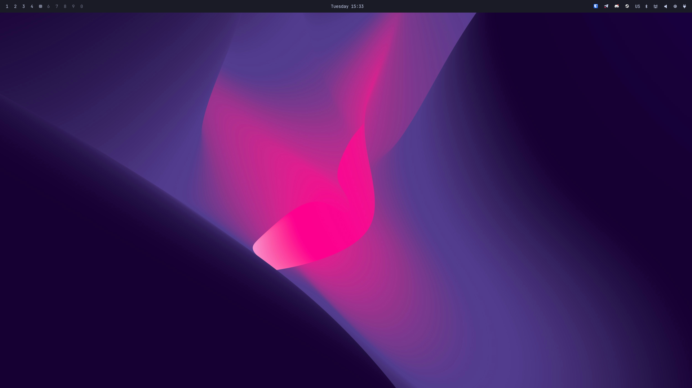
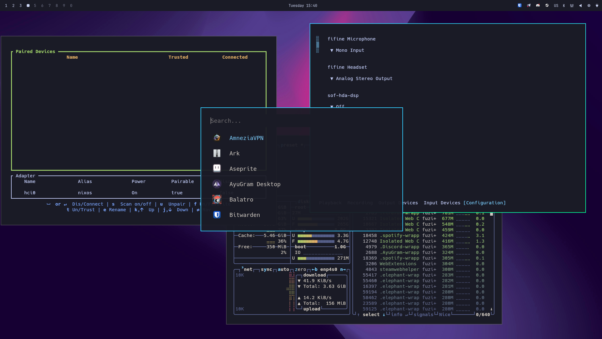

# Yozora

**IMPORTANT:** This installer and setup currently support **Arch Linux and Arch-based distributions only**. Running it on other distributions is not supported.

## Included Software

| Component       | Package   |
| --------------- | --------- |
| WM              | Hyprland  |
| Bar             | Waybar    |
| Terminal        | Kitty     |
| Shell           | Fish      |
| Notifications   | Mako      |
| Launcher        | Walker    |
| System Info     | Fastfetch |
| Monitor         | Btop      |
| Session Manager | uwsm      |

## Installation

Clone the repository:

```bash
git clone https://github.com/fuzifuziii/yozora.git
cd yozora
```

Run the installer:

```bash
./install.sh
```

## Basic binds

| Bind            | Module    |
| --------------- | --------- |
| Super           | Apps      |
| Super + K       | Binds     |
| Super + V       | Clipboard |
| Super + Period  | Symbol    |

## Screenshots

### Desktop


### Utilities

