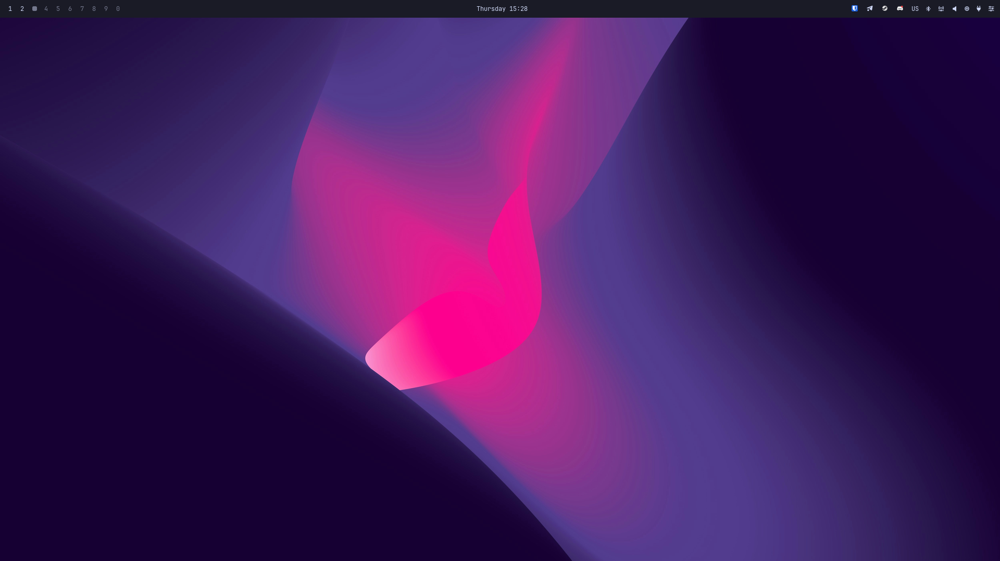
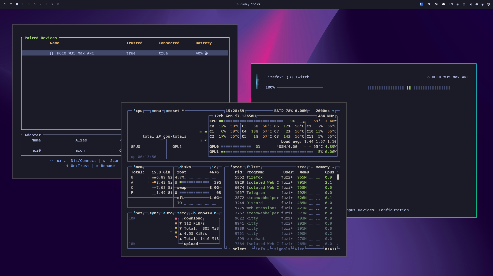
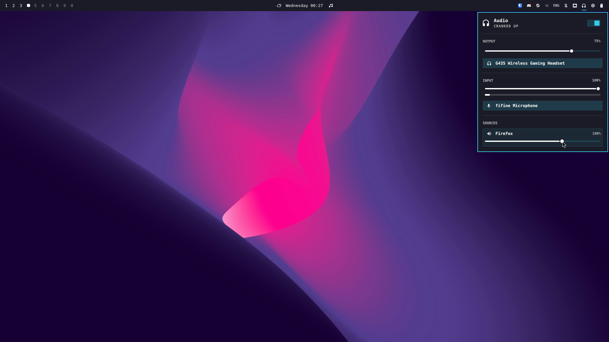

# Yozora

**IMPORTANT:** This installer and setup currently support **Arch Based and Void Linux only**. Running it on other distributions is not supported.

## Included Software

| Component       | Package    |
| --------------- | ---------- |
| WM              | Hyprland   |
| Widgets         | Quickshell |
| Terminal        | Kitty      |
| Shell           | Fish       |

## Installation

```bash
bash -c "$(wget -qO- https://raw.githubusercontent.com/fuzifuziii/yozora/main/bootstrap.sh)" -- --update
```

## Basic binds

| Bind            | Module    |
| --------------- | --------- |
| Super           | Apps      |
| Super + D       | Menu      |
| Super + K       | Binds     |
| Super + V       | Clipboard |
| Super + Period  | Symbol    |

## Screenshots

### Desktop


### Menu


### Utilities

